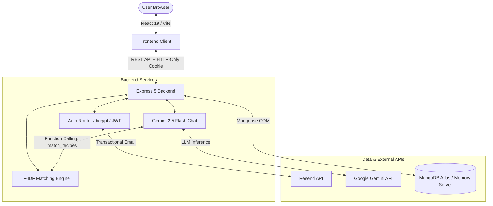

# 🍪 Cookie AI

Cookie AI (CookAI) is a full-stack, ingredient-first recipe matching platform and culinary assistant that solves the "empty fridge dilemma" by calculating what you can cook right now using the exact ingredients and equipment already in your kitchen.

[](https://www.typescriptlang.org/)
[](https://react.dev/)
[](https://vitejs.dev/)
[](https://expressjs.com/)
[](https://www.mongodb.com/)
[](https://deepmind.google/technologies/gemini/)
[](https://vitest.dev/)

---

## ✨ Key Features

- **TF-IDF & Cosine Similarity Engine** — Scores recipe feasibility mathematically based on ingredient rarity and coverage rather than naive keyword matching.
- **Fuzzy Typo Tolerance & Alias Normalization** — Automatically resolves plurals, regional synonyms, and typos (Levenshtein distance $\le 2$) to canonical ingredient IDs.
- **Smart Substitution Matrix** — Identifies culinary swaps (e.g., chicken $\leftrightarrow$ tofu, butter $\rightarrow$ oil) and awards 75% weighted score credit.
- **Equipment & Dietary Constraint Enforcement** — Strictly excludes recipes requiring unowned equipment, filters by prep time, and enforces vegetarian constraints.
- **Goal-Weighted Personalization** — Applies ranking bonuses for user-selected wellness targets (balanced, healthy, weight-loss, high-protein).
- **Gemini-Powered AI Culinary Chatbot** — Integrated conversational assistant with real-time Function Calling (`match_recipes`) to query verified database recipes.
- **Multi-Stage Verified Authentication** — Complete email OTP verification flow with cryptographically generated setup tokens, bcrypt hashing, and HTTP-only JWT sessions.

---

## 🧠 How It Works

Rather than standard string queries, Cookie AI uses an information retrieval vector-space model calibrated for cooking:

1. **Vocabulary Space & IDF Precomputation**: On server startup, the system indexes all catalog recipes ($N = 110$) and computes smoothed Inverse Document Frequency for every unique ingredient:
   $$\text{IDF}(t) = \ln\left(\frac{N + 1}{\text{df}(t) + 1}\right) + 1$$
   Ubiquitous ingredients (salt, onion) receive lower weight, while distinctive ingredients (saffron, paneer, miso) carry high discriminative signal.
2. **Query Vectorization & Pantry Staples**: The user's ingredients are normalized via aliases and Levenshtein distance, combined with auto-assumed pantry staples (oil, salt, water), and projected into a sparse query vector weighted by IDF.
3. **Substitution Injection**: If required ingredients are missing but valid substitutes exist in the user's pantry, they are injected into an effective recipe vector at 75% IDF weight.
4. **Scoring & Penalties**:
   $$\text{Coverage Score} = \frac{\vec{q} \cdot \vec{r}_{\text{effective}}}{\|\vec{r}_{\text{effective}}\|^2}$$
   - **Goal Bonus**: $+0.15$ score boost if the recipe matches the user's profile goal.
   - **Missing Penalty**: Subtracted proportionally based on missing required ingredients fraction.
5. **Tier Classification**: Recipes passing equipment and dietary filters are ranked and bucketed into intuitive tiers: `exact` ($\ge 0.55$ and 0 missing), `near` ($\ge 0.20$), and `low`.

---

## 🏗️ Architecture



### Data Flow
1. **User Input**: User selects ingredients, owned equipment, and dietary goals in the React frontend.
2. **API Request**: The payload is sent to `POST /api/ingredients/match` and strictly validated using Zod schemas.
3. **Vector Evaluation**: The backend executes in-memory vector dot-products against pre-indexed recipe vectors.
4. **Result Enrichment**: Matches are tagged with missing ingredients, valid substitutions, and match tiers.
5. **Response Delivery**: JSON results populate responsive recipe cards with step-by-step instructions and YouTube links.

---

## 🔐 Authentication & Backend

- **Security Architecture**: Passwords hashed with `bcryptjs` (10 rounds). User sessions utilize signed JWT tokens delivered through `httpOnly`, `SameSite`, and `Secure` (production) cookies, preventing XSS token theft.
- **Two-Step Registration Flow**:
  1. `POST /api/auth/signup` or `POST /api/auth/resend-otp` generates a 6-digit OTP stored as a bcrypt hash with a 10-minute MongoDB TTL expiry.
  2. `POST /api/auth/verify-otp` validates the code and issues an ephemeral 32-byte cryptographic `setupToken` (15-min expiry).
  3. `POST /api/auth/set-password` consumes the token and creates the account.
- **Abuse Prevention**: In-memory sliding window rate-limiter restricts sensitive auth endpoints to 5 attempts per minute per email with a 60-second cooldown on OTP re-sends.
- **Database Fallback**: `server/db.ts` attempts connection to MongoDB Atlas; if no connection string is provided, it automatically boots an ephemeral `mongodb-memory-server` and seeds all 110 recipes, allowing immediate zero-configuration local runs.

---

## 🗄️ Data Model

```
┌─────────────────────────────────┐       ┌─────────────────────────────────┐
│             Account             │       │          PendingSignup          │
├─────────────────────────────────┤       ├─────────────────────────────────┤
│ _id: ObjectId                   │       │ _id: ObjectId                   │
│ email: String (unique, lower)   │       │ email: String (unique, lower)   │
│ passwordHash: String            │       │ otpHash: String                 │
│ createdAt: Date                 │       │ otpExpiresAt: Date (TTL Index)  │
└─────────────────────────────────┘       │ attempts: Number                │
                                          │ verified: Boolean               │
┌─────────────────────────────────┐       │ setupToken: String              │
│             Recipe              │       │ setupTokenExpiresAt: Date       │
├─────────────────────────────────┤       └─────────────────────────────────┘
│ _id: String (slug identifier)   │
│ title: String                   │
│ description: String             │
│ ingredients: [{ name, quantity, optional }]
│ equipment: [String]             │
│ instructions: [String]          │
│ tags: ['balanced'|'healthy'|'weight-loss'|'high-protein']
│ difficulty: 'easy' | 'medium'   │
│ timeMinutes: Number             │
└─────────────────────────────────┘
```

---

## 📡 API

| Method | Endpoint | Purpose |
|---|---|---|
| `POST` | `/api/ingredients/match` | Core matching: returns recipes ranked by TF-IDF score with substitutions & tiers |
| `GET` | `/api/recipes` | Retrieves complete catalogue of 110 recipes |
| `GET` | `/api/recipes/:id` | Detailed recipe instructions, prep steps, tips, and YouTube search link |
| `GET` | `/api/ingredients` | Returns dictionary of canonical ingredients and aliases |
| `GET` | `/api/equipment` | Lists all supported kitchen tools |
| `POST` | `/api/profile` | Saves user cooking profile (name, goal, equipment) |
| `POST` | `/api/chat` | AI culinary assistant powered by Gemini 2.5 Flash with tool calling |
| `POST` | `/api/auth/signup` | Direct account registration (email & password) |
| `POST` | `/api/auth/resend-otp` | Sends/resends 6-digit verification code via email |
| `POST` | `/api/auth/verify-otp` | Validates OTP and returns single-use setup token |
| `POST` | `/api/auth/set-password` | Finalizes verified registration with password |
| `POST` | `/api/auth/login` | Authenticates credentials and sets HTTP-only JWT cookie |
| `POST` | `/api/auth/logout` | Clears active authentication cookie |
| `GET` | `/api/auth/me` | Validates session and returns current user payload |

---

## 📁 Project Structure

```text
cookai/
├── public/                  # Static assets & 110+ curated recipe images
│   ├── images/              # Optimized recipe imagery
│   └── ui/                  # UI assets and hero video
├── server/                  # Backend application (Express 5 + TypeScript)
│   ├── auth/                # Auth routes, email dispatch, test suites
│   ├── models/              # Mongoose schemas (Account, PendingSignup, Recipe)
│   ├── routes/              # Feature routes (chat with Gemini integration)
│   ├── scripts/             # Database seeding scripts
│   ├── data.ts              # Canonical ingredients, aliases & base recipes
│   ├── db.ts                # Dual-mode database connection handler
│   ├── index.ts             # Server entry point & middleware pipeline
│   └── matching.ts          # TF-IDF, Levenshtein & substitution engine
├── src/                     # Frontend application (React 19 + TypeScript)
│   ├── components/          # UI modules (LandingPage, RecipeDetail, ChatBot, etc.)
│   ├── api.ts               # Typed client API layer
│   ├── App.tsx              # Root component, routing & global navigation
│   ├── main.tsx             # DOM mounting entry
│   ├── styles.css           # Custom glassmorphism design system
│   └── types.ts             # Shared frontend type declarations
├── package.json             # Monorepo dependencies & scripts
├── tsconfig.json            # Base TypeScript configuration
├── vercel.json              # Client routing & API reverse proxy configuration
└── vite.config.ts           # Vite build pipeline & dev proxy
```

---

## 🚀 Getting Started

### Prerequisites
- **Node.js**: v18.0.0 or higher
- **npm**: v9.0.0 or higher
- *(Optional)* Free **MongoDB Atlas** URI (in-memory MongoDB runs automatically if omitted)

### Installation

1. Clone the repository and install dependencies:
```bash
git clone https://github.com/nikitasachan2004/CookAI.git
cd CookAI
npm install
```

2. Configure environment variables (create `.env` in project root):
```env
PORT=3001
MONGODB_URI=mongodb+srv://<user>:<password>@cluster.mongodb.net/cookai
JWT_SECRET=your-random-jwt-secret-key-at-least-32-chars
GEMINI_API_KEY=your-google-gemini-api-key
RESEND_API_KEY=your-resend-api-key
EMAIL_FROM=onboarding@resend.dev
```
> *Note: If `MONGODB_URI` is omitted, the app starts with an ephemeral in-memory database. If `RESEND_API_KEY` is omitted, OTP codes are printed directly to the server terminal.*

3. Seed the recipe catalogue (optional for Atlas; auto-seeded in memory):
```bash
npm run seed:recipes
```

4. Launch frontend and backend concurrently:
```bash
npm run dev
```
- Frontend: `http://localhost:5173`
- Backend API: `http://localhost:3001/api`

### Verification & Testing
```bash
npm test         # Run unit & integration tests via Vitest
npm run build    # Type-check and produce optimized production bundle
```

---

## 🖥️ Screenshots

<div align="center">
  
  <p><i>Cookie AI — Smart Kitchen Inventory & Recipe Matching Engine</i></p>
</div>

- **Cinematic Hero**: Full-bleed background video hero with frosted liquid-glass navigation.
- **Interactive Matcher**: Multi-ingredient selector with real-time alias recognition and chip tags.
- **Recipe Cards**: Detailed match tiers, missing items badges, and substitution notices.
- **AI Sous-Chef**: Gemini-powered conversational assistant dock with clickable recipe cards.

---

## ⚙️ Engineering Highlights

1. **Sub-Millisecond Vector Matching**: Precomputing recipe vector magnitudes and IDF weights at startup allows in-memory cosine ranking of 110 recipes in under 2ms without hitting database bottlenecks.
2. **Deterministic Tool Use in LLM**: The Gemini 2.5 Flash chatbot uses strict schema Function Calling to execute the backend's deterministic `matchRecipes` algorithm, preventing hallucinated recipe advice.
3. **Resilient Dual-Mode Database**: The persistence layer uses MongoDB Atlas in production while automatically falling back to `mongodb-memory-server` in development, enabling full local testability with zero configuration.
4. **Defense-in-Depth Authentication**: Multi-stage state machine isolates unverified registrations into temporary TTL-indexed documents, ensuring no stale or unverified records pollute the primary user collection.
5. **Zero-Dependency Modern Design System**: Built with pure CSS variables and modern glassmorphism (backdrop filters, semantic tokens) avoiding bulky UI frameworks while maintaining responsive layouts.

---

## 🔮 Future Improvements

- **Multimodal Image Recognition**: Allow users to snap a photo of their fridge/pantry for automated ingredient detection.
- **Persistent Pantry Inventory**: Enable authenticated users to maintain a persistent inventory that updates after cooking.
- **Automated Grocery List Consolidation**: Generate a consolidated shopping list for missing ingredients across chosen recipes.

---

## 👨‍💻 Built With

- **Client**: React 19, TypeScript, Vite 7, React Router 7, Lucide Icons
- **Server**: Node.js, Express 5, Mongoose 9, Zod, bcryptjs, JSONWebToken
- **Intelligence**: Custom TF-IDF Cosine Matcher, Google Gemini 2.5 Flash API
- **Testing & Tooling**: Vitest, Supertest, Concurrently, Tsx
